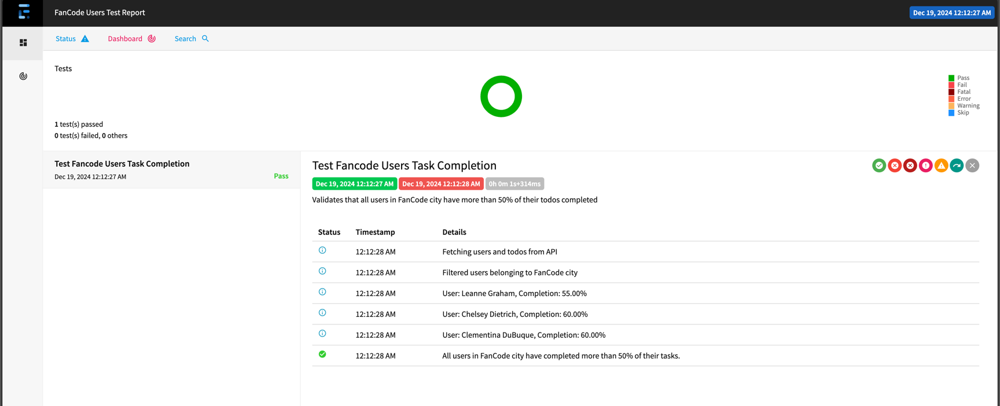

<<<<<<< HEAD
# SDET-Assignment
This is SDET Assignment for fan code.
=======
# SDET Assignment Solution
This is SDET Assignment for fan code. We are using java and maven.
This project will fetch the user will print the users which has todos completion more than 50%
Also we are generating a report and for reporting we are using extent report.

## Setup Instructions

1. Clone the repository:
   ```bash
   git clone <repository_url>
   cd SDET_Assignment
2. Verify the folder and it contents. If POM file adn src folder is present then run
   ```bash
   mvn -U clean test
3. After running this command you will see build success and extent report will get generated.
4. Open extent-report.html in any browser you will see the report like below.

>>>>>>> c5c78cb (Initial commit)
